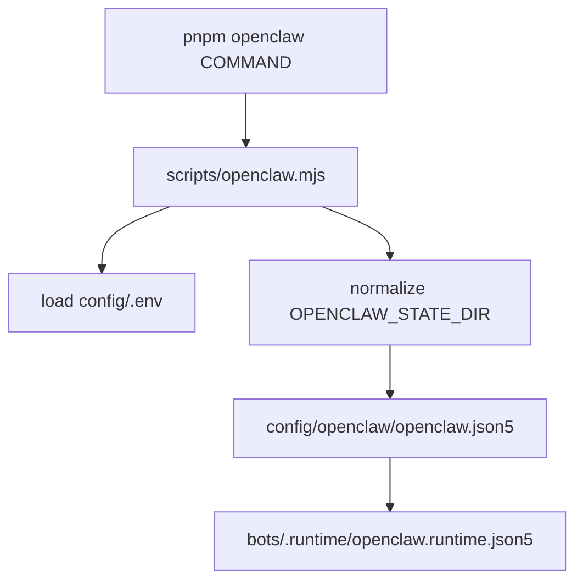

# openclaw-platform

Monorepo-style **OpenClaw** workspace for local usage + development (git submodule in `openclaw/`) with modular JSON5 config and optional Docker sandboxes.

- **English** (this file) · **中文**: [`README.zh-CN.md`](README.zh-CN.md)
- Run everything via `pnpm openclaw ...` (wrapper: [`scripts/openclaw.mjs`](scripts/openclaw.mjs))
- Commit-safe config lives in [`config/openclaw/`](config/openclaw/) (split into modular JSON5 files)
- Repo-local state lives in `bots/` (gitignored; migration notes in [`bots/README.md`](bots/README.md))
- Instead of the default `~/.openclaw/`, this repo pins state/config/workspaces under `bots/` (e.g. `bots/workspaces/<agent>/`) so everything stays in one place

> [!NOTE]
> You are reading the `monorepo` branch.
> If you need the Termux + proot setup and tooling, switch to the `proot-debian` branch.

> [!IMPORTANT]
> `config/.env` and `bots/` contain secrets/state. Keep them out of git.
>
> This repo intentionally tracks only `bots/README.md` and `bots/openclaw.json` under `bots/`.

## What this repo gives you

- A predictable, repo-local OpenClaw setup: config + workspaces + state live together under this repo folder (instead of `~/.openclaw/`).
- Modular JSON5 config you can edit/review in git (secrets stay in `config/.env`, never in JSON5).
- Repo-local plugins (custom tools/skills) under `plugins/` that live outside the `openclaw/` submodule.
- Optional Docker sandbox images for agents that need extra system dependencies (LibreOffice, OCR, etc.).

## Contents

- [Prerequisites](#prerequisites)
- [Quick start](#quick-start)
- [How config is wired](#how-config-is-wired)
- [Repo layout](#repo-layout)
- [Project tree (sketch)](#project-tree-sketch)
- [Docs](#docs)
- [Common commands](#common-commands)
- [Sandboxed agents (Docker)](#sandboxed-agents-docker)

## Prerequisites

- Node.js **24.x** (recommended; OpenClaw requires `>=22.12.0`)
- `corepack enable` (for `pnpm`)
- Docker (optional; only needed for sandboxed agents)

## Quick start

```bash
git clone --recurse-submodules https://github.com/appautomaton/openclaw-monorepo.git
cd openclaw-monorepo

git submodule update --init --recursive

corepack enable
pnpm openclaw:install
pnpm openclaw:build
pnpm openclaw:ui:build

cp config/.env.template config/.env
# Edit config/.env (never commit it)
# Optional: set EXA_API_KEY if you want the exa-search plugin/tool.

pnpm openclaw models status   # verify config loads (fails fast if env vars missing)
pnpm openclaw gateway
```

If you are setting up **Termux + proot-distro**, switch to the `proot-debian` branch and follow `docs/proot-setup.md` there.

## How config is wired

- Secrets live in `config/.env` (gitignored; copy from [`config/.env.template`](config/.env.template)).
- Source config entrypoint is [`bots/openclaw.json`](bots/openclaw.json):

```json5
{ $include: "../config/openclaw/openclaw.json5" }
```

- Modular source config lives under [`config/openclaw/`](config/openclaw/) (JSON5 + `$include`).
- The wrapper renders that source tree into `bots/.runtime/openclaw.runtime.json5` before launch, so OpenClaw writes back to disposable runtime state instead of the tracked source fragments.
- Config can reference env vars via `${ENV_VAR}` (missing/empty vars fail fast).
- `OPENCLAW_STATE_DIR=bots` is supported: [`scripts/openclaw.mjs`](scripts/openclaw.mjs) treats relative paths as repo-root-relative.



## Repo layout

All paths below are relative to the repo root.

- [`openclaw/`](openclaw/) — OpenClaw submodule (pnpm workspace; build output in `openclaw/dist/`)
- [`scripts/`](scripts/) — wrapper entrypoint (see [`scripts/README.md`](scripts/README.md))
- [`config/`](config/) — versioned config (commit-safe) + `config/.env.template`
- [`plugins/`](plugins/) — repo-local OpenClaw plugins (custom tools/skills; see [`plugins/README.md`](plugins/README.md))
- `bots/` — repo-local OpenClaw state dir (gitignored; see [`bots/README.md`](bots/README.md))
- [`dockerfiles/`](dockerfiles/) — Docker build contexts for sandbox images (see [`dockerfiles/README.md`](dockerfiles/README.md))
- [`docs/`](docs/) — extra docs for this repo

Architecture notes: [`ARCHITECTURE.md`](ARCHITECTURE.md)

## Project tree (sketch)

```text
.
├─ README.md
├─ package.json                  # repo wrapper scripts (pnpm openclaw:*)
├─ .gitmodules                   # pins the OpenClaw submodule
├─ openclaw/                     # OpenClaw submodule (upstream fork)
├─ scripts/
│  ├─ openclaw.mjs               # loads config/.env, normalizes OPENCLAW_STATE_DIR, runs OpenClaw CLI
│  └─ browser-service.sh         # optional helper for the browser sidecar
├─ plugins/                      # repo-local OpenClaw plugins (custom tools/skills)
│  ├─ README.md
│  └─ exa-search/                 # example: Exa Search plugin (tool + skill pack)
├─ config/
│  ├─ .env.template              # copy to config/.env (gitignored) and fill tokens/keys
│  ├─ README.md                  # config wiring notes
│  └─ openclaw/                  # modular JSON5 config (commit-safe; no secrets)
│     ├─ openclaw.json5          # source root JSON5 (uses $include)
│     └─ agents/                 # agent definitions (defaults + per-agent files)
├─ bots/                         # repo-local state dir (gitignored; sensitive)
│  ├─ README.md                  # migration/bootstrap notes (tracked)
│  └─ openclaw.json              # compatibility entrypoint (tracked; source config reference)
├─ dockerfiles/                  # sandbox image build contexts used by sandboxed agents
└─ docs/                         # extra docs for this repo
```

## Docs

- [`bots/README.md`](bots/README.md) — migrating from an existing `~/.openclaw/` install into repo-local state
- [`config/README.md`](config/README.md) — how config/env/state are wired
- [`docs/COMMANDS.md`](docs/COMMANDS.md) — command reference for this repo wrapper
- [`docs/proot-setup.md`](docs/proot-setup.md) — Termux + proot-distro setup notes (see `proot-debian` branch)
- `pnpm docs:check` — validates onboarding docs against executable repo truth

## Common commands

```bash
pnpm openclaw models status
pnpm openclaw agents list --bindings
pnpm openclaw channels status --probe
pnpm openclaw hooks list
pnpm openclaw nodes status
pnpm docs:check
```

## Sandboxed agents (Docker)

Only needed if an agent config uses `sandbox.docker.image` (i.e., you actually enabled Docker sandboxing for that agent).
Example: `config/openclaw/agents/list/writer.json5` sets `"image": "localhost/openclaw-sandbox-writer:bookworm"`.

```bash
docker build -f dockerfiles/writer/Dockerfile -t localhost/openclaw-sandbox-writer:bookworm dockerfiles/writer
```

See [`dockerfiles/`](dockerfiles/) and [`config/openclaw/agents/list/`](config/openclaw/agents/list/).
