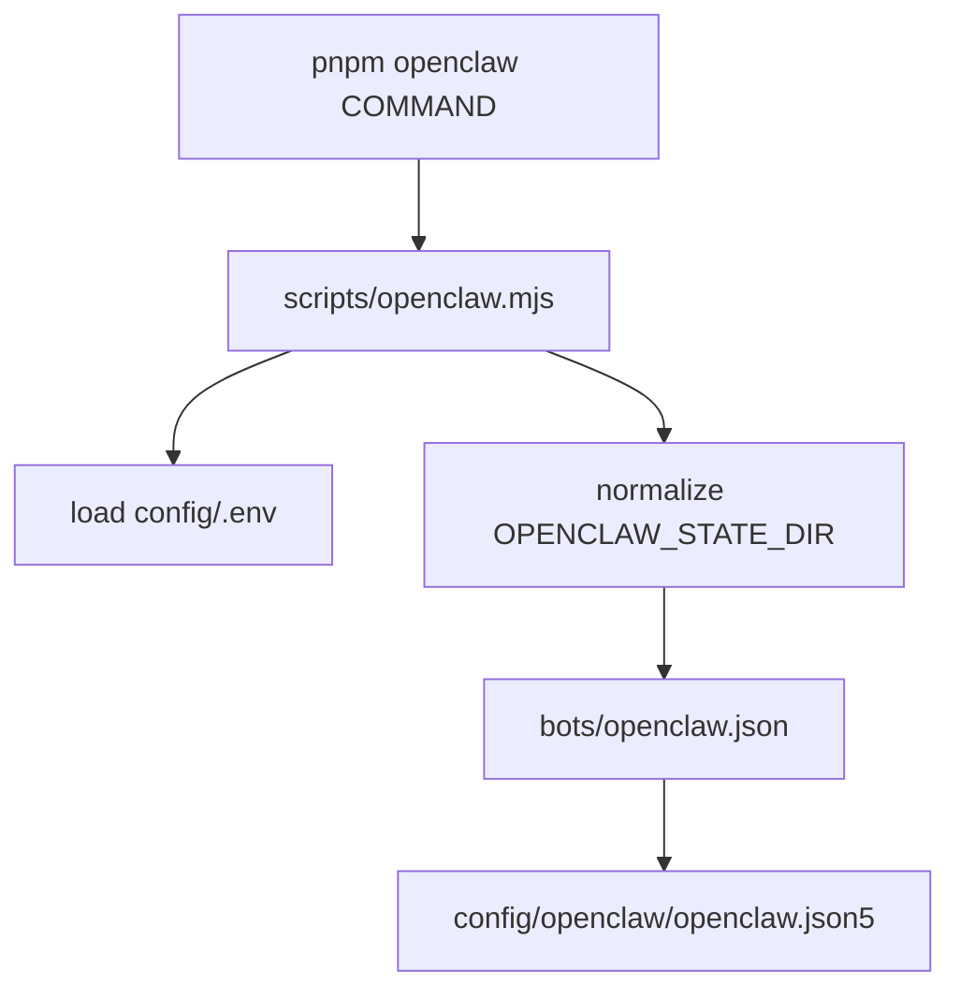

# openclaw-platform（中文说明）

> **English**: [`README.md`](README.md) · **中文**（本文件）

这是一个用于**本地使用/开发**的 OpenClaw 工作区（OpenClaw 作为 git submodule 放在 `openclaw/`），配置使用可拆分的 JSON5，并支持可选的 Docker sandbox agents。

- 统一入口：`pnpm openclaw ...`（wrapper：[`scripts/openclaw.mjs`](scripts/openclaw.mjs)）
- 可提交的配置：[`config/openclaw/`](config/openclaw/)（拆成多个 JSON5，方便编辑/Review）
- repo-local 的 state：`bots/`（gitignored；迁移说明见 [`bots/README.md`](bots/README.md)）
- 本 repo 会把默认的 `~/.openclaw/` 换成 repo 内的 `bots/`：state/config/workspaces 统一落在 `bots/`（例如 `bots/workspaces/<agent>/`），好处是“都在一个地方，方便搬迁/备份/Review”

> [!NOTE]
> 你正在阅读 `monorepo` 分支。
> 如果你需要 Termux + proot 的安装/工具链，请切到 `proot-debian` 分支。

> [!IMPORTANT]
> `config/.env` 和 `bots/` 可能包含 secrets/state，请不要提交到 git。
>
> 本 repo 在 `bots/` 下只会提交两份文件：`bots/README.md` 和 `bots/openclaw.json`。

## 这个仓库到底解决什么问题（人话）

- 你不用再去找 `~/.openclaw/`：这个仓库把 OpenClaw 的“状态目录/工作区/配置入口”统一放到 `bots/` 下面。
- 配置是拆开的 JSON5：你可以按模块改，比如 `agents/`、`channels/`、`tools/`，不会挤在一个巨大 JSON 里。
- `config/.env` 专门放密钥：配置文件里只引用 `${ENV_VAR}`，避免 secrets 混进 git。
- repo 内也支持放自定义 plugins（工具/技能包），统一放在 `plugins/`，不改 `openclaw/` submodule。

## 目录

- [前置条件](#前置条件)
- [快速开始](#快速开始)
- [配置是怎么连起来的](#配置是怎么连起来的)
- [仓库结构](#仓库结构)
- [目录树（速览）](#目录树速览)
- [文档索引](#文档索引)
- [常用命令](#常用命令)
- [沙盒 Agents（Docker）](#沙盒-agentsdocker)

## 前置条件

- Node.js **24.x**（推荐；OpenClaw 要求 `>=22.12.0`）
- `corepack enable`（提供 `pnpm`）
- Docker（可选；仅当你启用了某个 agent 的 Docker sandbox 时需要）

## 快速开始

```bash
git clone --recurse-submodules https://github.com/appautomaton/openclaw-monorepo.git
cd openclaw-monorepo

git submodule update --init --recursive

corepack enable
pnpm openclaw:install
pnpm openclaw:build
pnpm openclaw:ui:build

cp config/.env.template config/.env
# 编辑 config/.env（不要提交）
# 可选：如果要用 exa-search 插件/工具，请在 config/.env 里填 EXA_API_KEY

pnpm openclaw models status   # 先验证配置能加载（缺 env var 会直接报）
pnpm openclaw gateway
```

如果你是 Termux + proot 用户：请切到 `proot-debian` 分支，并按该分支的 `docs/proot-setup.md` 操作。

## 配置是怎么连起来的

- secrets 放在 `config/.env`（gitignored；从 [`config/.env.template`](config/.env.template) 复制）
- OpenClaw 读取的入口配置是 [`bots/openclaw.json`](bots/openclaw.json)：

```json5
{ $include: "../config/openclaw/openclaw.json5" }
```

- 真正的模块化配置在 [`config/openclaw/`](config/openclaw/)（JSON5 + `$include`）
- 配置里可用 `${ENV_VAR}` 引用环境变量（缺失/空值会 fail fast）
- `OPENCLAW_STATE_DIR=bots` 支持写相对路径：[`scripts/openclaw.mjs`](scripts/openclaw.mjs) 会按 repo 根目录解析



## 仓库结构

以下路径均相对 repo root：

- [`openclaw/`](openclaw/) — OpenClaw submodule（pnpm workspace；build 输出在 `openclaw/dist/`）
- [`scripts/`](scripts/) — wrapper/辅助脚本（见 [`scripts/README.md`](scripts/README.md)）
- [`config/`](config/) — 可提交的配置（JSON5 拆分）+ `config/.env.template`
- [`plugins/`](plugins/) — repo-local plugins（自定义工具/skills；见 [`plugins/README.md`](plugins/README.md)）
- `bots/` — repo-local state/workspaces（敏感；默认 gitignored；见 [`bots/README.md`](bots/README.md)）
- [`dockerfiles/`](dockerfiles/) — sandbox 镜像构建上下文（见 [`dockerfiles/README.md`](dockerfiles/README.md)）
- [`docs/`](docs/) — 本 repo 的额外文档

架构说明：[`ARCHITECTURE.md`](ARCHITECTURE.md)

## 目录树（速览）

```text
.
├─ README.md
├─ README.zh-CN.md
├─ package.json                  # repo wrapper scripts (pnpm openclaw:*)
├─ .gitmodules                   # pins the OpenClaw submodule
├─ openclaw/                     # OpenClaw submodule (upstream fork)
├─ scripts/
│  ├─ openclaw.mjs               # loads config/.env, normalizes OPENCLAW_STATE_DIR, runs OpenClaw CLI
│  └─ browser-service.sh         # optional helper for the browser sidecar
├─ plugins/                      # repo-local OpenClaw plugins（自定义工具/skills）
│  ├─ README.md
│  └─ exa-search/                 # 示例：Exa Search 插件（tool + skill pack）
├─ config/
│  ├─ .env.template              # copy to config/.env (gitignored) and fill tokens/keys
│  ├─ README.md                  # config wiring notes
│  └─ openclaw/                  # modular JSON5 config (commit-safe; no secrets)
│     ├─ openclaw.json5          # root JSON5 (uses $include)
│     └─ agents/                 # agent definitions (defaults + per-agent files)
├─ bots/                         # repo-local state dir (gitignored; sensitive)
│  ├─ README.md                  # migration/bootstrap notes (tracked)
│  └─ openclaw.json              # state config entrypoint (tracked; $include -> config/openclaw/openclaw.json5)
├─ dockerfiles/                  # sandbox image build contexts used by sandboxed agents
└─ docs/                         # extra docs for this repo
```

## 文档索引

- [`bots/README.md`](bots/README.md) — 从 `~/.openclaw/` 迁移到本 repo 的 `bots/`
- [`config/README.md`](config/README.md) — config/env/state 的连接方式
- [`docs/COMMANDS.md`](docs/COMMANDS.md) — 本 repo wrapper 的命令参考
- [`docs/proot-setup.md`](docs/proot-setup.md) — Termux + proot 说明（见 `proot-debian` 分支）
- `pnpm docs:check` — 校验 onboarding 文档是否和当前 repo 可执行事实一致

## 常用命令

```bash
pnpm openclaw models status
pnpm openclaw agents list --bindings
pnpm openclaw channels status --probe
pnpm openclaw hooks list
pnpm openclaw nodes status
pnpm docs:check
```

## 沙盒 Agents（Docker）

仅当某个 agent 配置里使用了 `sandbox.docker.image`（也就是启用了 Docker sandbox）才需要构建镜像。  
例如：`config/openclaw/agents/list/writer.json5` 里设置了 `"image": "localhost/openclaw-sandbox-writer:bookworm"`。

```bash
docker build -f dockerfiles/writer/Dockerfile -t localhost/openclaw-sandbox-writer:bookworm dockerfiles/writer
```

更多：[`dockerfiles/`](dockerfiles/) 与 [`config/openclaw/agents/list/`](config/openclaw/agents/list/)
